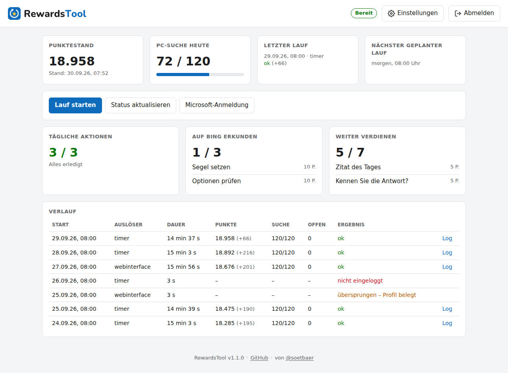
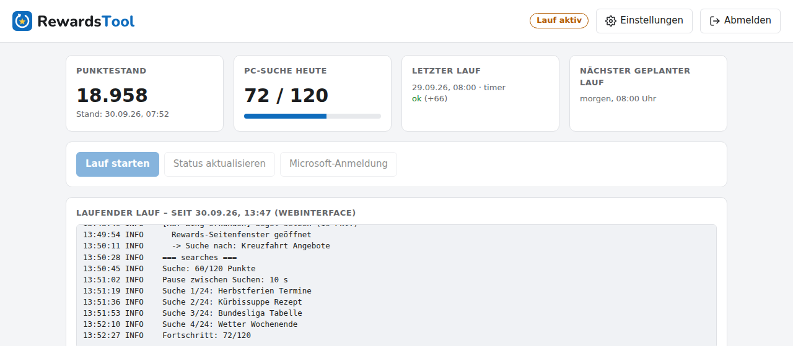
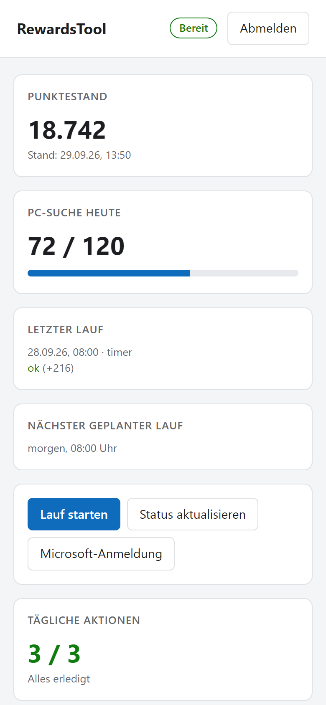
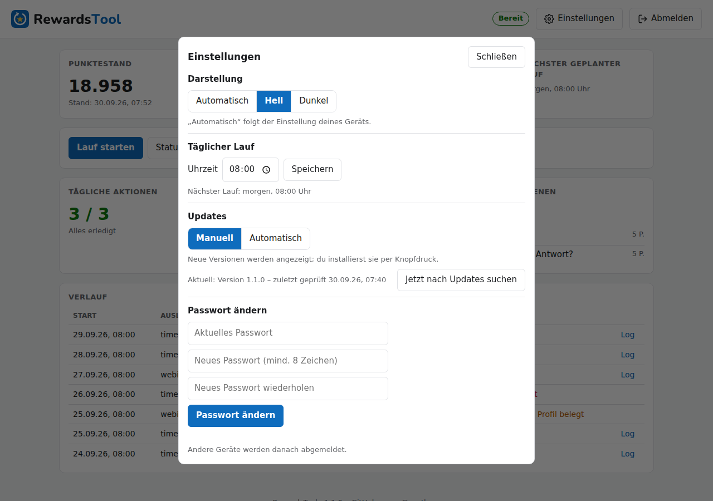
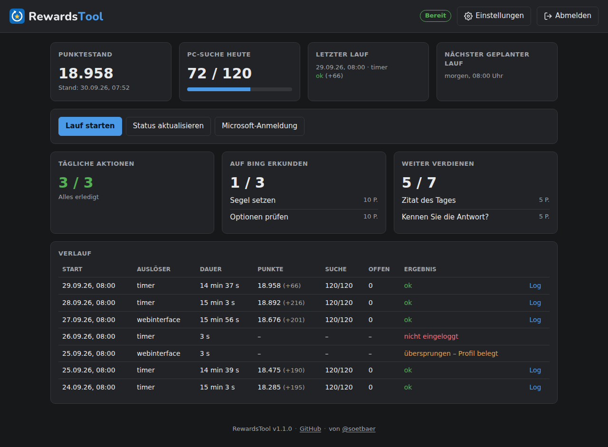
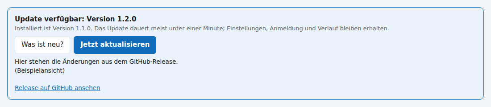
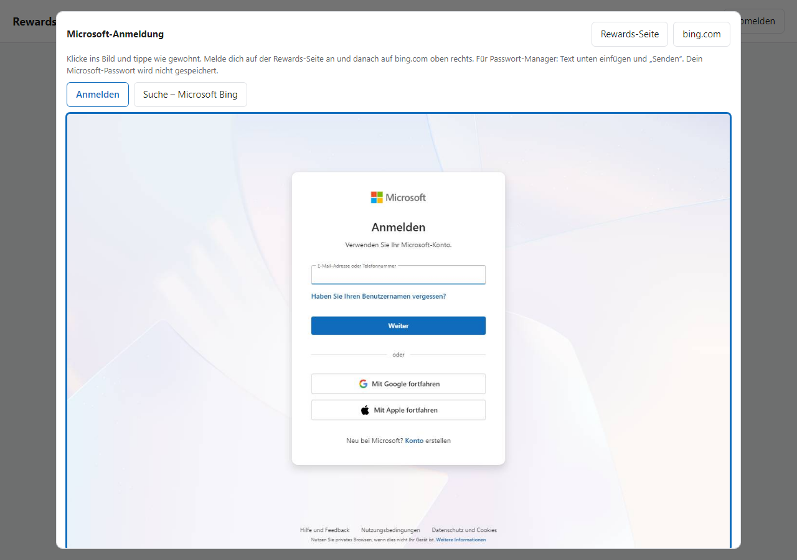
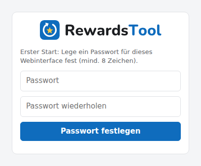

<p align="center"></p>

<p align="center">
  Sammelt jeden Tag automatisch deine <b>Microsoft-Rewards-Punkte</b>, damit du nicht selbst klicken musst.<br>
  <a href="https://github.com/soetbaer/RewardsTool/releases/latest"></a>
  
  <a href="LICENSE"></a>
</p>

Das Tool erledigt für dich:

| Aufgabe | Punkte pro Tag (ungefähr) |
|---|---|
| Tägliche Bing-Suchen am PC | bis zu 120 |
| Die 3 Kacheln „Tägliche Aktionen“ | ca. 30 |
| „Auf Bing erkunden“ (Suchen zu vorgegebenen Themen) | ca. 30 |
| „Weiter verdienen“ (weitere Kacheln, Quizze) | unterschiedlich |

**Nicht** abgedeckt: Punkte, die es nur in der **Bing-App auf dem Handy** gibt (z. B. Nachrichten lesen).

### Funktionen

- 🕗 **Läuft täglich von selbst** – zur Uhrzeit deiner Wahl (Windows-Aufgabenplanung oder Linux-Server)
- 🖥️ **Webinterface** – Punktestand, offene Aufgaben, Live-Protokoll und Verlauf; auch auf dem Handy
- 🔑 **Microsoft-Anmeldung im Browser** – ohne Bildschirm am Server, dein Passwort wird nie gespeichert
- 🔄 **Automatische Updates** – neue Versionen werden angezeigt und per Knopfdruck installiert, auf Wunsch
  ganz automatisch *(ab Version 1.1.0)*
- ⚙️ **Einstellungen** – Uhrzeit des täglichen Laufs, Update-Modus, Hell/Dunkel, Passwort ändern
- 🌙 **Dunkelmodus** – automatisch nach Geräteeinstellung oder fest eingestellt

---

## ⚠️ Bitte zuerst lesen

- **Microsoft erlaubt das automatische Sammeln nicht.** Es verstößt gegen die Microsoft-Rewards-Bedingungen.
  Microsoft kann gesammelte Punkte streichen oder dein Rewards-Konto sperren. **Du nutzt das Tool auf eigenes Risiko.**
- Dein **Microsoft-Passwort wird nie gespeichert.** Du meldest dich einmal selbst an; gespeichert wird nur die
  Anmeldung (wie „angemeldet bleiben“ im Browser) im Ordner `profile`.
- **Gib den Ordner `profile` niemals weiter** – wer ihn hat, ist in deinem Microsoft-Konto angemeldet.
  Dasselbe gilt für die Ordner `data`, `logs` und `debug` und eine Datei `session.json`.

---

## Download

Die aktuelle Version gibt es auf der **[Releases-Seite](https://github.com/soetbaer/RewardsTool/releases/latest)**:
dort unter „Assets“ die Datei **`RewardsTool-….zip`** herunterladen (nicht „Source code“).

---

## So sieht es aus

Das **Webinterface** zeigt Punktestand, Suchfortschritt, offene Aufgaben und alle bisherigen Läufe –
und lässt dich Läufe starten und dich bei Microsoft anmelden, alles im Browser.
*(Screenshots mit Beispieldaten.)*



<table>
  <tr>
    <td width="68%"><br><sub><b>Laufender Lauf</b> mit Live-Protokoll</sub></td>
    <td width="32%"><br><sub><b>Auf dem Handy</b></sub></td>
  </tr>
  <tr>
    <td width="50%"><br><sub><b>Einstellungen:</b> Uhrzeit, Updates, Darstellung, Passwort</sub></td>
    <td width="50%"><br><sub><b>Dunkelmodus</b></sub></td>
  </tr>
</table>


<sub><b>Updates:</b> Neue Versionen erscheinen oben im Webinterface – „Jetzt aktualisieren“ genügt.</sub>


<sub><b>Microsoft-Anmeldung im Webinterface:</b> Live-Bild des Browsers – hineinklicken und tippen wie gewohnt.</sub>

---

## Welche Variante passt zu dir?

| | **A: Windows-PC** | **B: Linux-Server** (z. B. Heimserver, Raspberry Pi 64-Bit) |
|---|---|---|
| Geeignet für | alle, die nur einen PC haben | alle, die einen Rechner haben, der immer läuft |
| Läuft automatisch | nur wenn der PC an ist und du angemeldet bist | jeden Tag, auch wenn dein PC aus ist |
| Bedienung | Webinterface im Browser (Desktop-Verknüpfung) | Webinterface im Browser |
| Einrichtung | Doppelklick auf `Setup.bat` | einmalig ein paar Befehle eintippen |

---

## Variante A: Windows-PC

Du brauchst nur **eine Datei**: `Setup.bat`. Sie installiert alles Nötige – auch Python, falls es fehlt.

### Schritt 1 – RewardsTool entpacken

1. Speichere die ZIP-Datei (z. B. `RewardsTool-1.1.0.zip`).
2. Rechtsklick darauf → **„Alle extrahieren …“** → als Ziel z. B. `C:\RewardsTool` wählen → **„Extrahieren“**.

### Schritt 2 – Doppelklick auf `Setup.bat`

Im entpackten Ordner liegt **`Setup.bat`**. Doppelklick darauf.

> Falls Windows „Der Computer wurde durch Windows geschützt“ meldet:
> auf **„Weitere Informationen“** und dann **„Trotzdem ausführen“** klicken.

Ein blaues bzw. schwarzes Fenster führt dich durch die Einrichtung. Es fragt nur wenige Dinge – im Zweifel
einfach **Enter** drücken, dann wird die empfohlene Einstellung genommen:

| Was passiert | Was du tun musst |
|---|---|
| Hinweis zum Risiko | Mit **Enter** bestätigen |
| Python wird geprüft und bei Bedarf **automatisch installiert** | nichts – warten (1–3 Minuten) |
| Programmpakete werden installiert | nichts – warten (1–3 Minuten) |
| **Microsoft-Anmeldung:** ein Browserfenster mit zwei Tabs öffnet sich | Tab 1: mit deinem Microsoft-Konto anmelden („Angemeldet bleiben?“ → **Ja**). Tab 2 (bing.com): oben rechts ebenfalls anmelden. Dann zurück ins Setup-Fenster und **Enter** drücken. |
| Frage nach der **Uhrzeit** für den täglichen Lauf | z. B. `09:00` eintippen oder einfach **Enter** |
| Frage „Webinterface automatisch mit Windows starten?“ | **Enter** (= Ja) |
| „Fertig!“ – dein Browser öffnet das Webinterface | Dort ein **Passwort für das Webinterface** festlegen |

Das war's. Auf deinem Desktop liegt jetzt die Verknüpfung **„RewardsTool“** – darüber öffnest du jederzeit das
[Webinterface](#das-webinterface), siehst deine Punkte und kannst einen Lauf starten.

### Gut zu wissen

- Das Tool läuft ab jetzt **jeden Tag zur gewählten Uhrzeit** – wenn der PC an ist und du angemeldet bist.
  War der PC zu der Zeit aus, wird der Lauf beim nächsten Anmelden nachgeholt.
- Während eines Laufs erscheint ein **Browserfenster**, das von alleine sucht und klickt.
  **Nicht schließen und nicht hineinklicken** – nach 10–20 Minuten schließt es sich selbst.
- **Setup.bat erneut ausführen** ist harmlos: So reparierst oder aktualisierst du die Installation.
  Deine Anmeldung bleibt erhalten.
- Webinterface startet nicht automatisch? Doppelklick auf `windows\Webinterface-starten.bat`.

---

## Variante B: Linux-Server

Voraussetzungen: **Debian oder Ubuntu** (oder ein Abkömmling wie Raspberry Pi OS **64-Bit**), Internet, ein
Benutzer mit `sudo`-Rechten. Ein Bildschirm am Server ist **nicht** nötig.

### Schritt 1 – Herunterladen und installieren (einmalig, ca. 5–10 Minuten)

Am Server anmelden (z. B. mit PuTTY) und diese Befehle eintippen. Sie laden die aktuelle Version direkt von
GitHub – du musst vorher nichts herunterladen oder auf den Server kopieren. Die Uhrzeit am Ende ist die tägliche Startzeit:

```
cd ~
sudo apt-get install -y curl unzip
curl -fLO https://github.com/soetbaer/RewardsTool/releases/latest/download/RewardsTool.zip
unzip RewardsTool.zip && rm RewardsTool.zip
cd RewardsTool
bash deploy/install.sh 08:00
```

Zwischendurch wird ggf. dein Passwort für `sudo` abgefragt. Am Ende steht die Adresse des Webinterfaces, z. B.
`Webinterface: http://192.168.178.20:3333`.

Tipp: Stelle die Zeitzone richtig ein, damit „08:00“ auch 8 Uhr deutscher Zeit ist:

```
sudo timedatectl set-timezone Europe/Berlin
```

### Schritt 2 – Webinterface öffnen und anmelden

1. Öffne die angezeigte Adresse (z. B. `http://192.168.178.20:3333`) im Browser an deinem PC oder Handy.
2. Beim ersten Aufruf legst du ein **Passwort für das Webinterface** fest (mind. 8 Zeichen). **Mach das direkt
   nach der Installation** – bis dahin könnte das jeder in deinem Heimnetz tun.
3. Klicke auf **„Microsoft-Anmeldung“** und melde dich an (siehe unten).

Ab jetzt läuft alles automatisch. Den Server musst du nicht mehr per PuTTY anfassen.

---

## Das Webinterface

Beim **allerersten Aufruf** legst du ein Passwort für das Webinterface fest – danach meldest du dich damit an:



**Oben:** Punktestand, Fortschritt der PC-Suche, letzter Lauf, nächster geplanter Lauf.
Rechts oben zeigt ein Schild, ob das Tool **„Bereit“** ist oder gerade arbeitet.

**Knöpfe:**

| Knopf | Was passiert |
|---|---|
| **Lauf starten** | Sammelt sofort Punkte. Darunter erscheint das Protokoll live. |
| **Status aktualisieren** | Holt den aktuellen Punktestand und die offenen Aufgaben (dauert ca. 20 Sekunden). |
| **Microsoft-Anmeldung** | Zum (erneuten) Anmelden bei Microsoft. |

**Darunter:** die drei Bereiche *Tägliche Aktionen*, *Auf Bing erkunden* und *Weiter verdienen* – mit allem,
was noch offen ist. Ganz unten der **Verlauf** aller Läufe; mit **„Log“** siehst du das Protokoll eines Laufs.
Im Fuß der Seite steht die installierte Version.

**Einstellungen** (Zahnrad oben rechts):

| Einstellung | Was sie bewirkt |
|---|---|
| **Darstellung** | Automatisch (wie dein Gerät), Hell oder Dunkel |
| **Täglicher Lauf** | Uhrzeit des automatischen Laufs ändern |
| **Updates** | *Manuell* (Standard): neue Versionen werden angezeigt, du installierst per Knopfdruck. *Automatisch*: wird installiert, sobald kein Lauf aktiv ist. |
| **Passwort ändern** | Neues Passwort fürs Webinterface; andere Geräte werden abgemeldet |

### Bei Microsoft anmelden über das Webinterface

1. **„Microsoft-Anmeldung“** klicken. Nach ein paar Sekunden siehst du ein **Live-Bild** des Browsers auf dem Server.
2. **In das Bild klicken** (z. B. ins E-Mail-Feld) und ganz normal **tippen**. Das Bild aktualisiert sich etwa jede Sekunde.
3. Passwort aus einem Passwort-Manager? Unten ins Feld **„Text ins aktive Feld senden“** einfügen → **„Senden“**.
4. Falls nötig: Code aus der Authenticator-App oder SMS genauso eintippen.
5. Oben auf den Tab **bing.com** wechseln (oder Knopf **„bing.com“**) und dort oben rechts ebenfalls anmelden.
6. **„Fertig – Anmeldung prüfen“** klicken. Es erscheint **„Angemeldet – Punktestand …“**.

> Das Live-Bild ist etwas träge. Lieber langsam tippen und kurz warten, bis die Eingabe erscheint.

---

## Hilfe bei Problemen

| Was du siehst | Was du tun kannst |
|---|---|
| **„Nicht eingeloggt“** / rotes Feld „Nicht bei Microsoft angemeldet“ | Die Anmeldung ist abgelaufen. Im Webinterface auf **„Microsoft-Anmeldung“** klicken und neu anmelden. |
| **„Das Browserprofil wird gerade benutzt“** | Es läuft schon ein Lauf oder eine Anmeldung. Warten, bis sie fertig ist. |
| Kacheln unter **„Auf Bing erkunden“ bleiben offen** | Diese zählen nur mit sichtbarem Browserfenster. Nicht mit `--headless` starten (die Windows-Dateien und der Server machen das automatisch richtig). |
| **Suchen werden nicht gezählt** | Im Verlauf „Log“ öffnen und nach „NICHT gezählt“ suchen. Meist hilft neu anmelden. |
| Setup meldet **„Python konnte nicht automatisch installiert werden“** | Python von <https://www.python.org/downloads/> installieren, dabei den Haken **„Add python.exe to PATH“** setzen, dann `Setup.bat` erneut starten. |
| Webinterface öffnet sich nicht (Windows) | Doppelklick auf `windows\Webinterface-starten.bat`. |
| **Webinterface-Passwort vergessen** | Im RewardsTool-Ordner die Datei `data\webui_auth.json` löschen (Server: `rm ~/RewardsTool/data/webui_auth.json`). Beim nächsten Aufruf neues Passwort festlegen. |
| Webinterface **nicht erreichbar** (Server) | Richtige IP-Adresse? Läuft der Dienst? Auf dem Server: `sudo systemctl restart rewardstool-web` |
| Ein Lauf bringt **+0 Punkte** | Alles für heute ist schon erledigt – das ist normal. |

---

## Sicherheit & Datenschutz

- Alles bleibt auf **deinem** Rechner. Das Tool schickt nichts an Dritte, nur die normalen Aufrufe an Microsoft/Bing.
- Das Webinterface ist **nur für dein Heimnetz** gedacht. Es nutzt keine Verschlüsselung (HTTP).
  **Richte im Router keine Portfreigabe dafür ein.** Für Zugriff von unterwegs: VPN ins Heimnetz (z. B. FRITZ!Box-VPN, WireGuard).
- Gespeichert werden: Anmeldung (`profile`), Punktestand und Verlauf (`data`), Protokolle (`logs`), Screenshots
  zur Fehlersuche (`debug`). Diese Ordner gehören nur dir – **nicht weitergeben**.

---

## Update auf eine neue Version

Ab Version 1.1.0 geht das **im Webinterface**: Gibt es eine neue Version, erscheint oben ein blauer Hinweis –
**„Jetzt aktualisieren“** klicken, nach etwa einer Minute ist die neue Version aktiv. Anmeldung, Verlauf und
deine Werte in der `config.json` bleiben erhalten. Das Tool sucht alle 6 Stunden auf GitHub nach neuen Versionen.

> [!IMPORTANT]
> **Kommst du von Version 1.0.0?** Dann musst du das Update auf 1.1.0 **einmal von Hand** installieren (siehe unten) –
> erst danach hat dein RewardsTool den Updater und alle weiteren Updates laufen über das Webinterface.

Von Hand:

- **Windows:** Neue ZIP in **denselben Ordner** entpacken und Dateien überschreiben lassen. Danach
  `Setup.bat` erneut starten. Deine Anmeldung bleibt erhalten.
- **Server:** Diese Befehle laden die aktuelle Version direkt von GitHub und installieren sie:
  ```
  cd ~
  curl -fLO https://github.com/soetbaer/RewardsTool/releases/latest/download/RewardsTool.zip
  unzip -o RewardsTool.zip && rm RewardsTool.zip
  cd RewardsTool && bash deploy/install.sh 08:00
  ```
  Die Uhrzeit am Ende ist wieder die tägliche Startzeit.

Achtung: Dabei wird die `config.json` überschrieben. Falls du darin etwas geändert hast, vorher sichern.
Auf dem Server richtet `install.sh` dabei auch die Berechtigung ein, mit der das Webinterface die Uhrzeit des
täglichen Laufs ändern darf.

## Deinstallieren

- **Windows:** Doppelklick auf `windows\Deinstallieren.bat` (entfernt täglichen Lauf, Autostart und
  Verknüpfungen), danach den ganzen Ordner löschen.
- **Server:**
  ```
  sudo systemctl disable --now rewardstool.timer rewardstool-web.service
  sudo rm /etc/systemd/system/rewardstool.* /etc/systemd/system/rewardstool-web.service
  sudo rm /usr/local/sbin/rewardstool-set-time /etc/sudoers.d/rewardstool
  rm -rf ~/RewardsTool
  ```

---

## Einstellungen (optional)

In der Datei `config.json` (mit dem Editor öffnen):

| Einstellung | Bedeutung |
|---|---|
| `"search": { "delay": 10 }` | Pause zwischen zwei Suchen in Sekunden (1–120) |
| `"webui": { "port": 3333 }` | Port des Webinterfaces |
| `"activities": { "topic_queries": … }` | Suchbegriffe für „Auf Bing erkunden“-Themen |

Alles Weitere für Fortgeschrittene (Befehle, Technik) steht in **[TECHNIK.md](TECHNIK.md)**.

---

## Lizenz

RewardsTool steht unter der **[MIT-Lizenz](LICENSE)**: Du darfst es kostenlos nutzen, verändern und weitergeben –
auch kommerziell –, solange der Lizenzhinweis erhalten bleibt. Es gibt **keine Gewährleistung**; die Nutzung
erfolgt auf eigenes Risiko (siehe [Bitte zuerst lesen](#️-bitte-zuerst-lesen)).
